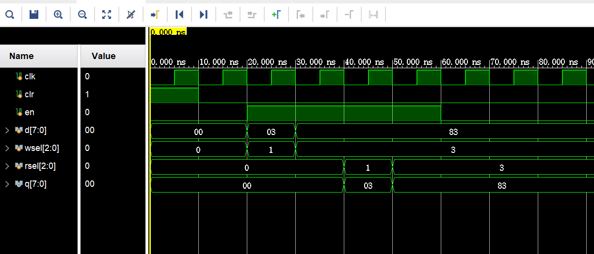
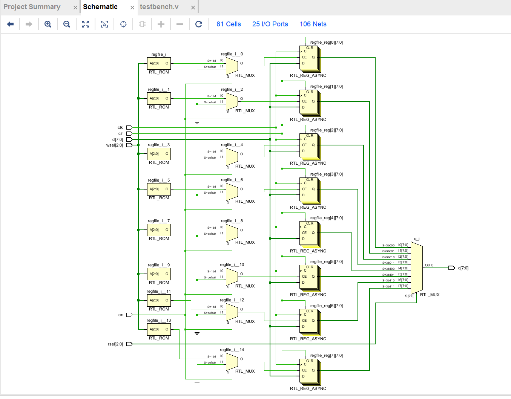
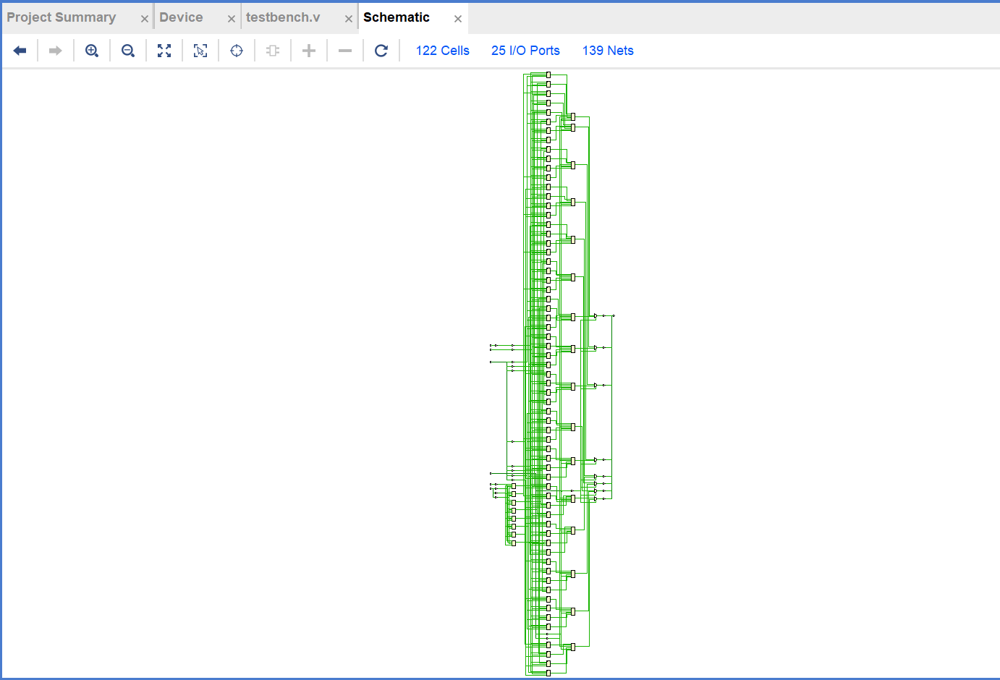
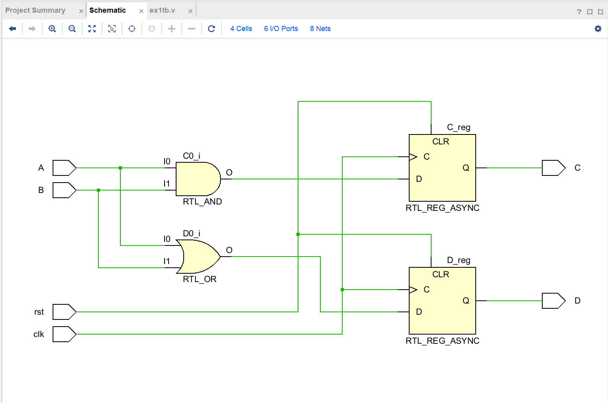
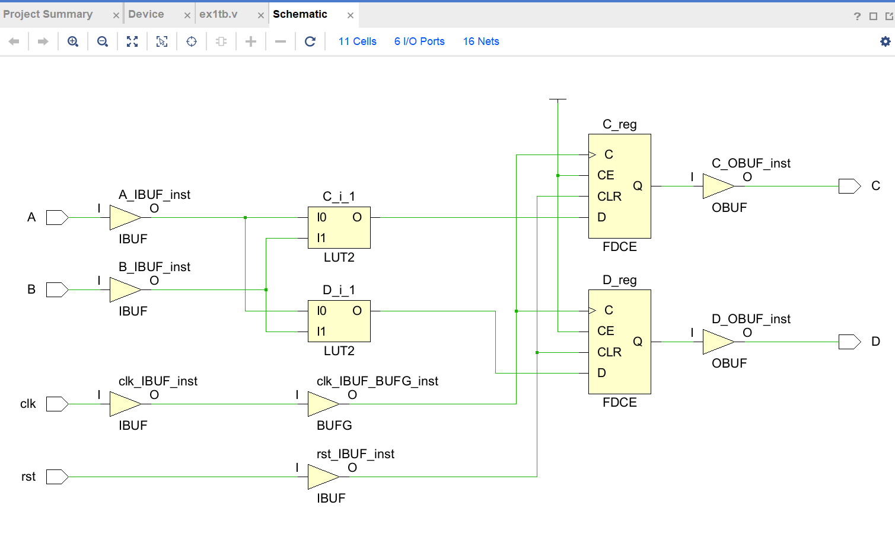
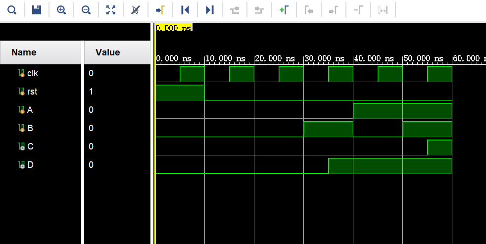
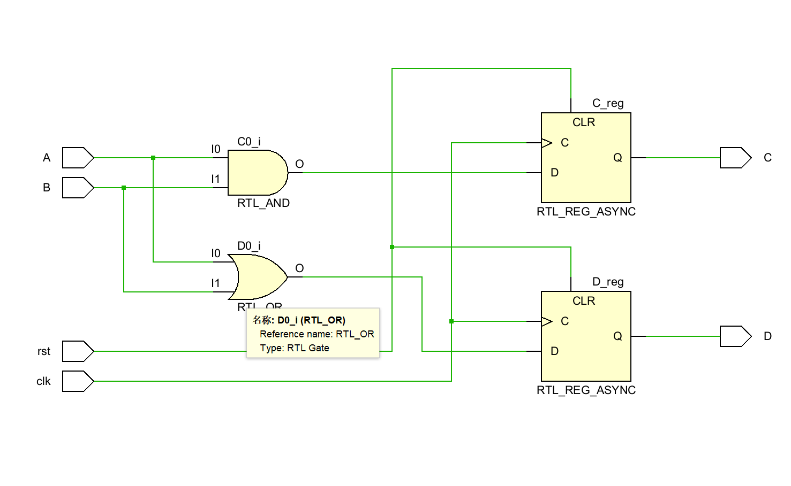
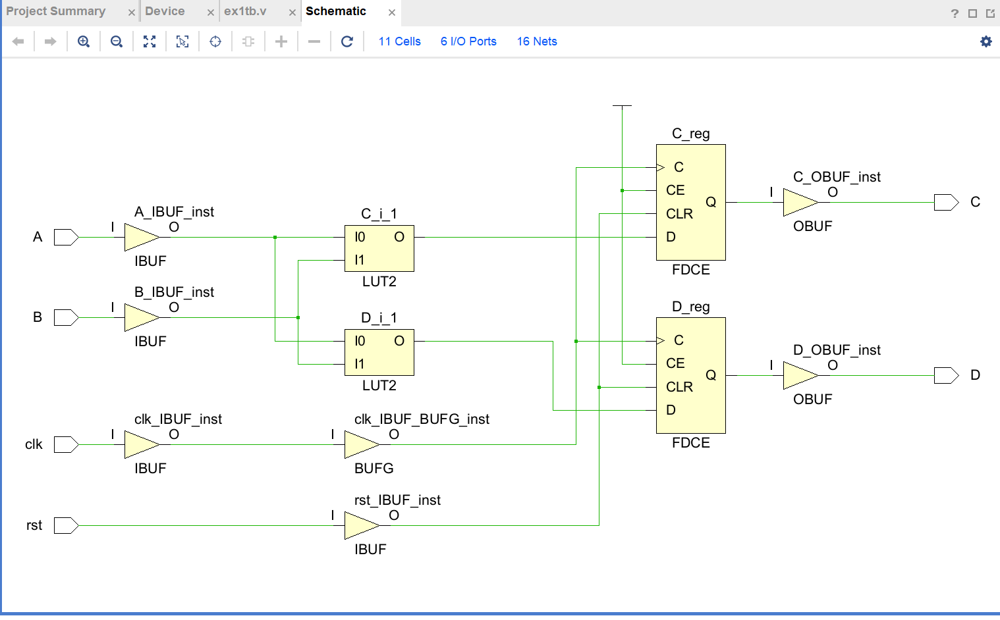
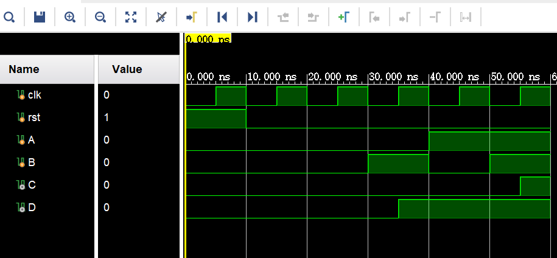

## 数逻实验1：寄存器实验

> 姓名：宁中昊
>
> 学号：2023311709
>
> 班级：7班
>
> 学期：大二秋季学期
>
> 实验项目：实验1：寄存器实验
>
> 上课地点：T2612
>
> 实验完成时间：3h

### 实验截图

1. 仿真波形分析截图

（见下页）

2. RTL Analysis 截图

    

3. Synthesis Schematic 截图

### 课后作业

#### 截图

1. 非阻塞赋值：

    * RTL 分析

        

    * 综合

        

    

    

    

    

    

    

    

    * 仿真

        

2. 阻塞赋值：

    * RTL 分析

        

    * 综合

        

    * 仿真

        

#### 异同

> 可以看到阻塞赋值与非阻塞赋值在这里的仿真、RTL 分析与综合均完全相同