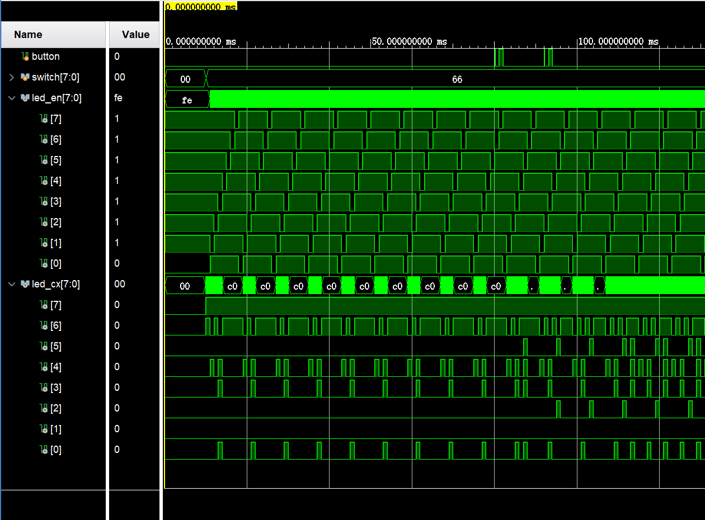
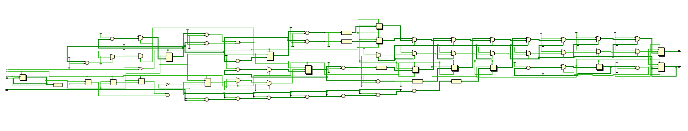

## 数逻实验3：数码管控制实验

> 姓名：宁中昊
>
> 学号：2023311709
>
> 班级：7班
>
> 学期：大二秋季学期
>
> 实验项目：实验3：数码管控制实验
>
> 上课地点：T2612
>
> 实验完成时间：8h

[toc]

### 实验截图

1. 仿真波形截图

    

    如图：

    * 复位：均为低电平

    * 启动后第一组计数器显示学号（$09$），第二组计数器显示拨码开关赋值 $01100110$ 时其中 $1$ 的个数（$04$）

    * 带抖动的按钮：共两次，按下后第三组数码管马上计数，可以看到抖动对第三组数码管的计数无影响，成功消抖

    * $0.1\text s$（即 $100 \text{ms}$）后，第四组计数器计数加一（$00\Rightarrow 01$​）

        

2. RTL 分析图

    

3. 数码管字符编码表：

    | 字符      | 编码（CA~CG-DP） |
    | --------- | ---------------- |
    | $\text 0$ | $00000011$       |
    | $\text 1$ | $10011111$       |
    | $\text 2$ | $00100101$       |
    | $\text 3$ | $00001101$       |
    | $\text 4$ | $10011001$       |
    | $\text 5$ | $01001001$       |
    | $\text 6$ | $01000001$       |
    | $\text 7$ | $00011111$       |
    | $\text 8$ | $00000001$       |
    | $\text 9$ | $00001001$       |
    | $\text A$ | $00010001$       |
    | $\text B$ | $11000001$       |
    | $\text C$ | $01100011$       |
    | $\text D$ | $10000101$       |
    | $\text E$ | $01100001$       |
    | $\text F$ | $01110001$       |

    

