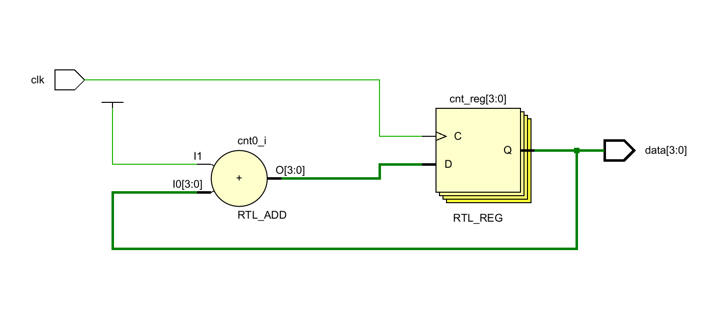

## 数逻实验2：计数器实验

> 姓名：宁中昊
>
> 学号：2023311709
>
> 班级：7班
>
> 学期：大二秋季学期
>
> 实验项目：实验2：计数器实验
>
> 上课地点：T2612
>
> 实验完成时间：7h

[toc]

### 实验截图

1. 仿真波形分析截图

2. RTL 分析图

其中三级寄存器级联位于左上角，单独截图如下：

3. 时间间隔对应计数器最大值计算：
    $$
    \begin{align*}
    &cnt\_end_{100\text{Hz}} = \frac{100\text{MHz}}{100\text{Hz}} = 10^6\\
    &cnt\_end_{10\text{Hz}} = \frac{100\text{MHz}}{10\text{Hz}} = 10^7\\
    &cnt\_end_{4\text{Hz}} = \frac{100\text{MHz}}{4\text{Hz}} = 2.5 \times 10^7\\
    &cnt\_end_{2\text{Hz}} = \frac{100\text{MHz}}{2\text{Hz}} = 5 \times 10^7\\
    \end{align*}
    $$

### 课后作业

#### 截图

* ex1

    * 阻塞赋值

        * RTL分析

        

        * 综合电路图

        

        * 仿真波形

            

    * 非阻塞赋值

        * RTL分析

            

        * 综合电路图

        

        * 仿真波形

            

* ex2

    * 阻塞赋值

        * RTL分析

            

        * 综合电路图

            

        * 仿真波形

            

    * 非阻塞赋值

        * RTL分析

            

        * 综合电路图

            

        * 仿真波形

            

#### 对比

1. RTL 分析图：阻塞赋值顺序执行，因此RTL分析结果就按正常顺序进行；非阻塞赋值则会使得RTL分析图具有反馈，因为他不是按顺序一步一步进行的。

2. 综合电路图：阻塞赋值按顺序执行，非阻塞电路在每一级寄存器处都有反馈。

3. 仿真波形：

    在 ex1 中，阻塞赋值时每个时钟周期中计数器变量 cnt 被赋值为 5 而后加 1，执行过程中立即将其赋值为 6；非阻塞赋值时，时钟上升沿到来，立刻更新了计数器变量 cnt 的值，将其赋值为 5 后马上将其更新为上一个时钟上升沿到来时的值加 1，造成了覆盖，因此执行结果是每个时钟上升沿到来时 cnt + 1。

    在 ex2 中，阻塞赋值时在时钟上升沿到来是立刻按顺序进行赋值，因此在对 F 赋值时 B 已被赋值为 A，B的值不再不能确定，因此第一个时钟上升沿到来时，F 的不确定状态就已结束；非阻塞赋值时，时钟上升沿到来时同步进行两个赋值，将 B 的上一个状态即不确定 X 赋值给了 F，到下一个时钟上升沿到来时才结束不确定的状态。

4. 回答问题：

    1. 对比1

    * 阻塞赋值

        * 一个时钟后，`cnt = 6`；

        * 两个时钟后，`cnt = 6`。

    * 非阻塞赋值

        * 一个时钟后，`cnt = 1`；
        * 两个时钟后，`cnt = 2`。
