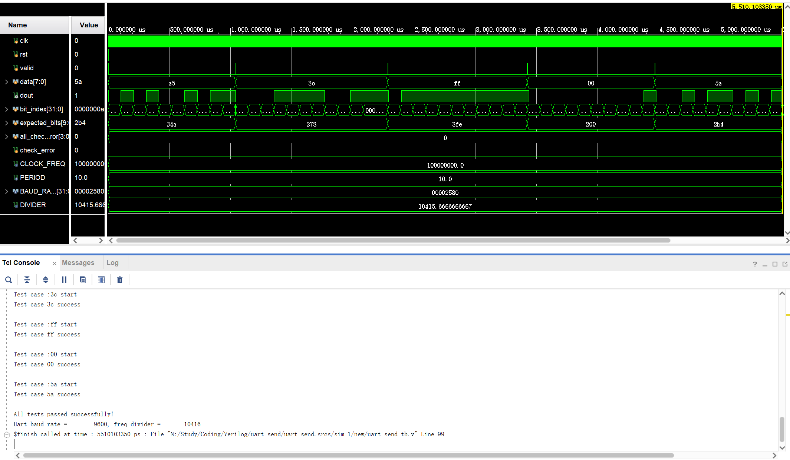
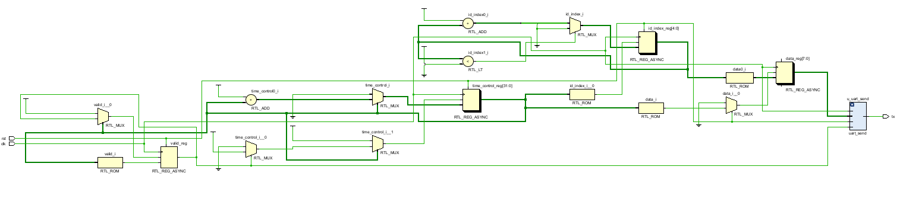
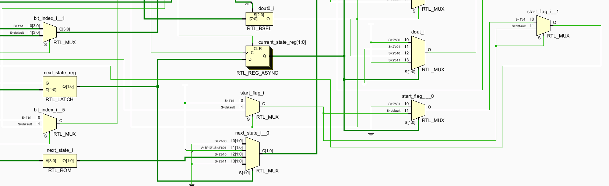
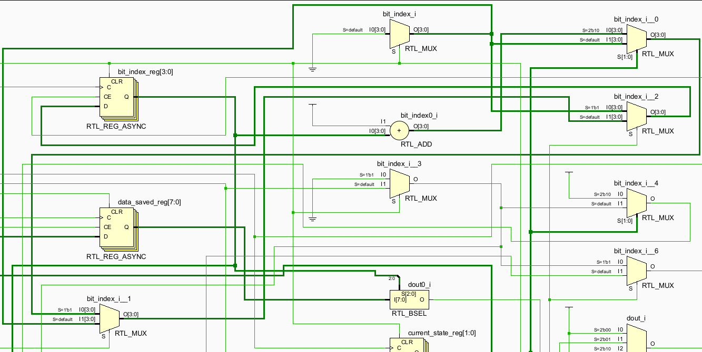

## 数逻实验4：状态机实验

> 姓名：宁中昊
>
> 学号：2023311709
>
> 班级：7班
>
> 学期：大二秋季学期
>
> 实验项目：实验3：数码管控制实验
>
> 上课地点：T2612
>
> 实验完成时间：8h

[toc]

### 实验截图

1. 状态图

    

    如图，右侧 $8$ 个 $\text{DATA}$ 数据状态即 $8$ 个数据位，通过 `bit_index` 的自增来移位输出发送数据。

    $\text{STOP}$ 停止状态后立即进入 $\text{IDLE}$​ 空闲状态。

    

2. 仿真波形分析

    

    如图，进行了五次测试案例（其中原版代码中的 `ff` 案例错误地赋值为了 `00`，已纠正过来）。

    第一次测试：`a5`，即 `10100101`；

    第二次测试：`3c`，即 `00111100`；

    第三次测试：`ff`，即 `11111111`；

    第四次测试：`00`，即 `00000000`；

    第五次测试：`5a`，即 `01011010`；

    均通过测试，且从波形上看能正确得到数据。

    `valid` 持续一个时钟，次态比现态领先一个时钟。

    

3. RTL 分析图

    

    将 `u_uart_send` 展开得到：

    

    其中状态寄存器：

    

    转移逻辑：

    

    输出：

    